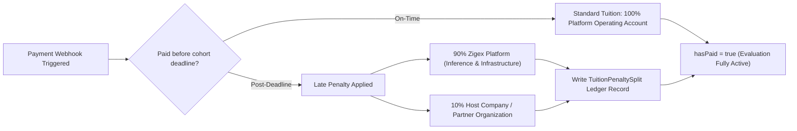

# Zila Business Model, Monetization Policy & Penalty Revenue Sharing Specification

> **Audience:** Product Managers, Finance Operations, Platform Engineers, Partner Liaisons  
> **Applicable Services:** `zigex-app`, `zila-api`, `@zigex/zila`

---

## 1. Executive Summary

Zila provides a high-leverage evaluation and task automation infrastructure for modern software engineering internships. To balance accessibility for emerging talent with sustainable platform revenue and incentivized corporate partnerships, Zila employs a **hybrid freemium + deadline penalty revenue split** business model.

---

## 2. The 6-Free-Task Tier Policy

Every student enrolled in a recognized cohort (e.g., Embedded Systems, Machine Learning, Web Engineering, Cybersecurity) receives a complimentary trial evaluation quota:
- **Free Quota:** Exactly **6 curriculum tasks** submitted via `zila submit-task`.
- **Full Capabilities Included:**
  - Automated branch and PR creation.
  - Automated testing and logbook enrichment.
  - Real-time placement on the cohort leaderboard (`⏳ Pending` ➔ `✔ Accepted`).
  - Supervisor review and PR merge validation.

---

## 3. Quota Enforcement & Evaluation Freezing

On attempting submission #7 without payment clearance:
1. `zila-api` queries the student's enrollment record in the Neon PostgreSQL database:
   ```typescript
   if (!enrollment.hasPaid && studentSubmissionsCount >= 6) {
     return res.status(402).json({
       error: "Payment Required: Free evaluation quota reached (6/6). Please complete payment to resume evaluations.",
       paymentRequired: true,
       checkoutUrl: `https://zigex.com/checkout?studentId=${enrollment.studentId}&cohortId=${enrollment.cohortId}`
     });
   }
   ```
2. The Lil-Zila TUI agent catches the HTTP 402 code and gracefully pauses the pipeline:
   ```
   lil-zila › evaluation access paused
   ────────────────────────────────────────────────────────────────────────
   You have completed your 6 free curriculum submissions.
   To continue receiving automated evaluation, supervisor PR merges,
   and leaderboard accreditation, please complete your internship tuition.
   
   Secure Checkout URL: https://zigex.com/checkout?id=...
   ────────────────────────────────────────────────────────────────────────
   ```

---

## 4. Admin Management on Zigex Web Platform

Within the web administrative interface (`zigex-app`):
- Navigation: **Admin Panel ➔ Students ➔ Records Tab**.
- Administrators have direct control over each student's payment state via an interactive toggle:
  - `hasPaid: true | false`
  - `feeStatus: 'unpaid' | 'paid_ontime' | 'paid_late'`
  - `exemptions: 'scholarship' | 'none'`

When an admin toggles a student to `hasPaid = true`, the API immediately lifts the evaluation freeze, enabling subsequent PR submissions and merges.

---

## 5. Post-Deadline Late Penalty Fee Distribution (90% / 10% Split)

Internships have designated sprint and modular milestone completion dates.

### 5.1 On-Time Payment
Students who pay tuition on or before the cohort deadline pay the standard tuition fee.

### 5.2 Late Payment Penalty
Students completing payment after the scheduled cohort deadline incur a late penalty fee surcharge.

### 5.3 Revenue Distribution Formula
The late penalty fee is deterministically split between the platform and the sponsoring corporate entity:

$$\text{Total Penalty} = \text{Late Fee Amount}$$
$$\text{Zigex Share} = 0.90 \times \text{Total Penalty}$$
$$\text{Host Company Share} = 0.10 \times \text{Total Penalty}$$

- **90% Allocated to Zigex:** Reimburses cloud server execution, AI LLM inference costs (Gemini / Groq / Claude / OpenAI token streams), database bandwidth, and platform maintenance.
- **10% Allocated to the Host Company:** Compensates the partner company hosting and curating the internship track for mentor engagement and delayed milestone coordination.




---

## 6. Financial Ledger & Audit Trail

All transactions, splits, and payouts are immutably logged in the `TuitionPenaltySplit` audit table:
```prisma
model TuitionPenaltySplit {
  id              String   @id @default(cuid())
  studentId       String
  cohortId        String
  totalPenalty    Float
  zigexShare      Float
  companyShare    Float
  hostCompanyId   String
  paidAt          DateTime @default(now())
}
```
